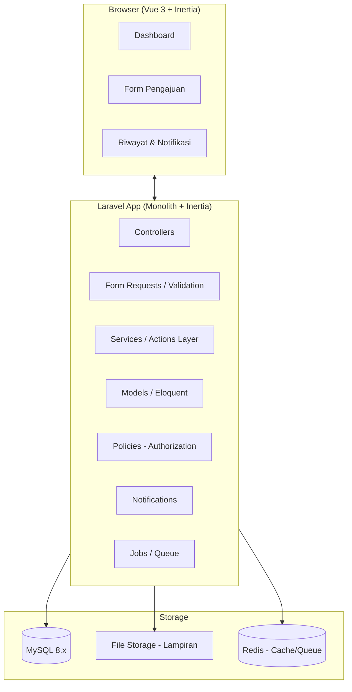
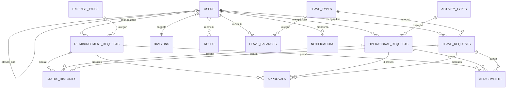
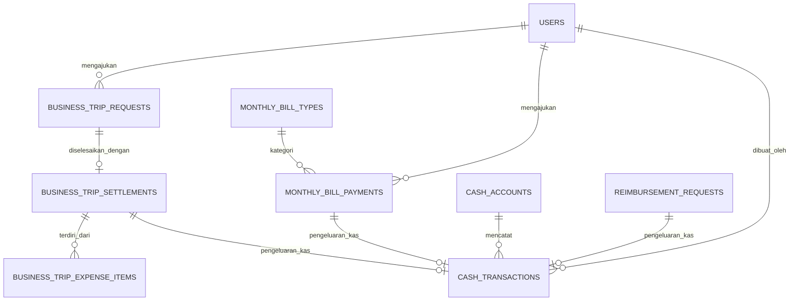
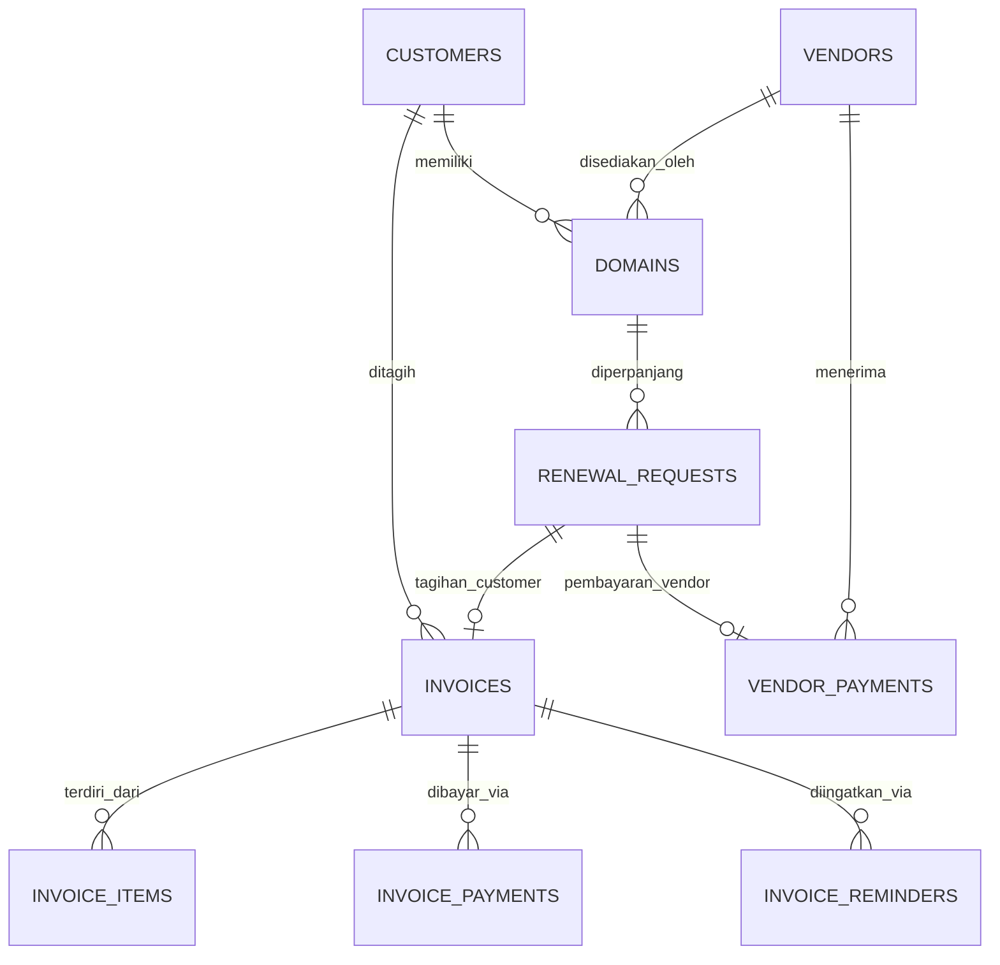
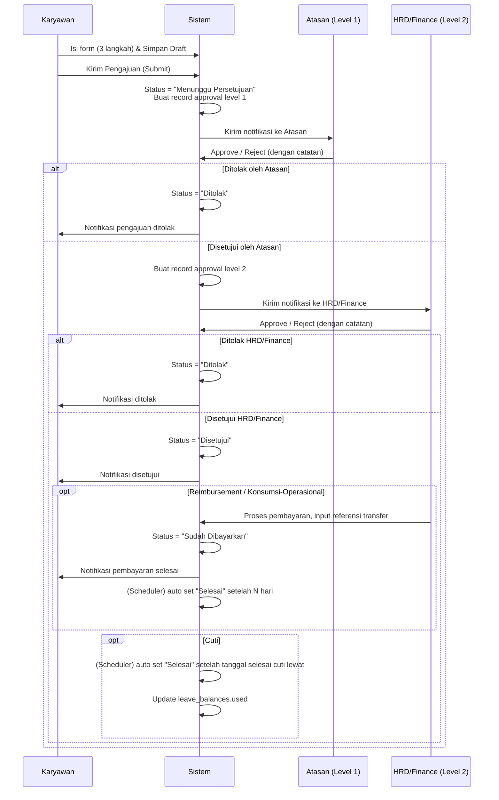
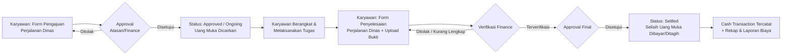
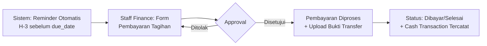
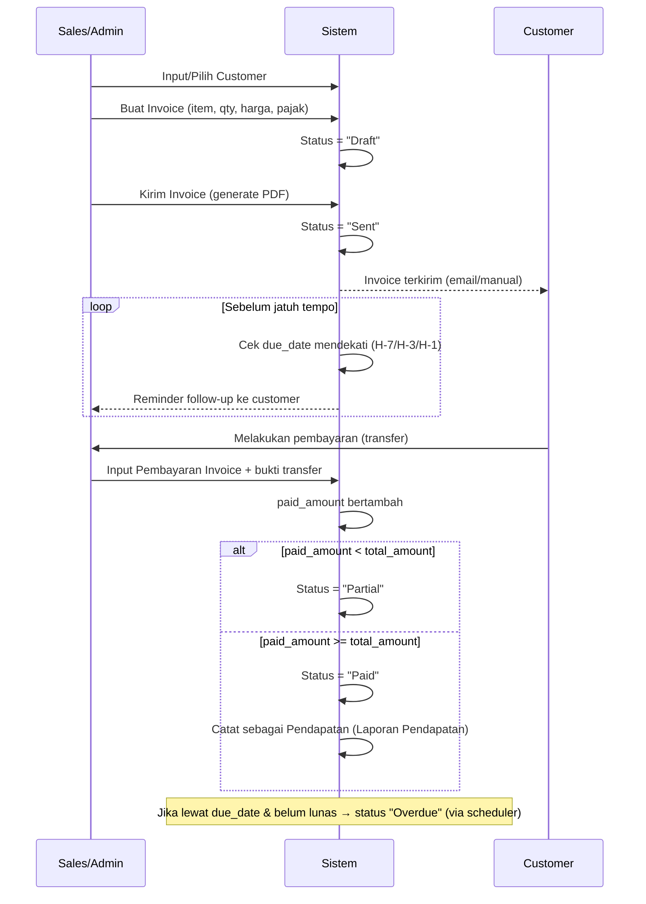
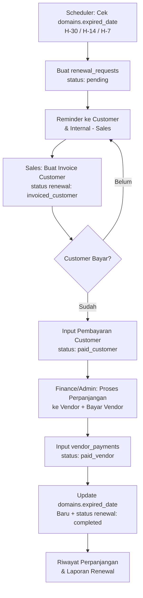
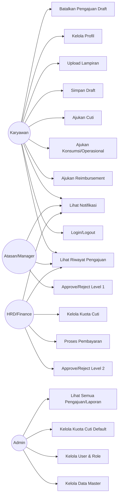

# Blueprint Sistem (Final) — EDU Employee Self Service (ESS)

Dokumen ini adalah blueprint teknis **final** untuk membangun sistem **Employee Self Service (ESS)** sesuai mockup yang diberikan, dengan 3 modul pengajuan utama:

1. **Reimbursement Karyawan**
2. **Konsumsi / Operasional**
3. **Cuti Karyawan**

**Stack final yang digunakan:**
- Backend: **Laravel 11.x**
- Frontend: **Inertia.js + Vue 3 + Tailwind CSS**
- Database: **MySQL 8.x**

Tidak ada lagi opsi/alternatif terbuka — seluruh keputusan teknis di dokumen ini bersifat final dan siap dieksekusi langsung oleh AI agentic (misal: Claude Code) sebagai acuan pengembangan end-to-end: arsitektur, database, alur bisnis, use case, API, hingga struktur folder.

---

## 1. Ringkasan Proyek

### 1.1 Deskripsi
Portal internal berbasis web yang memungkinkan karyawan mengajukan **reimbursement**, **konsumsi/operasional**, dan **cuti** secara digital, dengan alur persetujuan berjenjang (atasan → HRD/Finance), tracking status real-time, riwayat pengajuan, dan notifikasi.

### 1.2 Modul Utama (dari mockup)
- **Dashboard/Beranda**: kartu 3 layanan pengajuan + ringkasan status pengajuan pribadi (Menunggu Persetujuan, Disetujui, Ditolak, Sudah Dibayarkan, Selesai).
- **Pengajuan Reimbursement**: form 3 langkah (Informasi → Lampiran → Review & Kirim).
- **Pengajuan Konsumsi/Operasional**: form 3 langkah (Informasi → Lampiran → Review & Kirim).
- **Pengajuan Cuti**: form 3 langkah (Informasi → Lampiran Opsional → Review & Kirim).
- **Riwayat & Status**: Riwayat Pengajuan, Notifikasi.
- **Akun Saya**: Profil Saya, Keluar (logout).

### 1.2.1 Modul Tambahan (Perluasan Sistem — Keuangan & Operasional)

Selain modul ESS di atas, sistem diperluas menjadi platform **Finance & Operations** dengan modul-modul berikut (detail lengkap ada di **Bagian 16** dan **Bagian 17**):

| Modul | Sub Modul | Sifat |
|---|---|---|
| **Kas Operasional** | Perjalanan Dinas (pengajuan & penyelesaian) | Pengeluaran |
| | Reimburse (Meeting, Transport, dll) | Pengeluaran |
| | Pembayaran Bulanan Rutin (Listrik, Internet, Parkir, dll) | Pengeluaran |
| | Kas Operasional (Transaksi, Saldo, Laporan) | Pengeluaran/Kas |
| **Invoicing** | Customer & Invoice (Invoice, Pembayaran, Reminder) | Pendapatan |
| **Renewal Webpraktis** | Domain & Hosting (Renewal, Invoice, Pembayaran Customer/Vendor, Reminder) | Pendapatan |

> Modul-modul ini menggunakan **arsitektur & konvensi teknis yang sama** dengan modul ESS inti (Form Request validation, Policy authorization, Action pattern, notifikasi, audit trail via `status_histories`), sehingga tetap 1 platform terintegrasi dengan Laravel + Inertia + Vue + MySQL.

### 1.3 Aktor / Role Pengguna
| Role | Deskripsi |
|---|---|
| **Karyawan (Employee)** | Membuat, mengedit draft, dan mengirim pengajuan; memantau status. |
| **Atasan Langsung (Manager/Approver L1)** | Approve/reject pengajuan bawahannya (level 1). |
| **HRD/Finance (Approver L2)** | Validasi akhir, approve/reject, dan memproses pembayaran (untuk reimbursement & konsumsi/operasional) atau approval cuti final. |
| **Admin/Superadmin** | Mengelola data master (divisi, jenis pengeluaran, jenis kegiatan, jenis cuti), mengelola user & role, mengatur kuota cuti. |
| **Finance/Kasir (Kas Operasional)** | Mengelola kas operasional (transaksi, saldo), verifikasi & memproses pembayaran reimburse/perjalanan dinas/tagihan bulanan. *(Bisa memakai role `hrd_finance` yang sudah ada, diperluas cakupannya, atau role baru `finance_ops` jika ingin dipisah dari HRD).* |
| **Sales/Admin Invoicing** | Mengelola data customer, membuat & mengirim invoice, mencatat pembayaran customer, mengirim reminder jatuh tempo (modul Invoicing & Renewal Webpraktis). |

---

## 2. Tech Stack Rekomendasi

### 2.1 Backend
- **Laravel 11.x** (PHP 8.3+)
- **Laravel Sanctum** — autentikasi SPA (session-based cookie auth, cocok untuk Inertia).
- **Laravel Breeze (starter kit, Inertia stack)** — scaffolding auth cepat.
- **Spatie Laravel Permission** — role & permission management (employee, manager, hrd, admin).
- **Spatie Laravel Medialibrary** — manajemen file lampiran (bukti reimbursement, dokumen cuti, dll).
- **Laravel Notifications** — notifikasi in-app (database channel) + email.
- **Laravel Queue (database/redis driver)** — proses notifikasi & generate PDF/nomor pengajuan secara async.
- **Laravel Excel (maatwebsite/excel)** — export riwayat pengajuan ke Excel (opsional, untuk HRD/Finance).
- **DomPDF / Snappy** — generate bukti pengajuan / slip approval dalam PDF (opsional).

### 2.2 Frontend — Stack Final (Keputusan)
> **Laravel + Inertia.js + Vue 3 + Tailwind CSS**

**Alasan:**
- Mockup memiliki UI custom yang detail (multi-step form, stepper, card dashboard, modal) → butuh fleksibilitas komponen seperti SPA, tapi tetap 1 codebase dengan Laravel (tidak perlu REST API terpisah + auth token management yang rumit).
- Inertia menghilangkan kebutuhan membangun REST API penuh sekaligus menjaga pengalaman SPA (routing tanpa reload, state management ringan).
- Vue 3 (Composition API) + Tailwind CSS sangat cocok untuk membangun stepper form, komponen kartu, dan komponen reusable (Badge status, Modal, Stepper).
- Ekosistem component library pendukung: **Headless UI (Vue)**, **VueUse**, **Vue Toastification** (untuk notifikasi toast).

**Setup awal:**
```bash
composer create-project laravel/laravel edu-ess
cd edu-ess
composer require laravel/breeze --dev
php artisan breeze:install vue
npm install
```

### 2.3 Database — Final
- **MySQL 8.x**

### 2.4 Infrastruktur Pendukung
- **Redis** — cache & queue driver.
- **Laravel Horizon** — monitoring queue (opsional, untuk production).
- **Laravel Telescope** — debugging saat development.
- **Vite** — bundler frontend (default Laravel 11).

---

## 3. Arsitektur Sistem



### 3.1 Pola Desain
- **Service/Action Pattern**: logika bisnis (mis. proses approval, generate nomor pengajuan, hitung total hari cuti) dipisahkan dari Controller ke dalam class `Actions` atau `Services` agar mudah di-testing dan reusable.
- **Form Request Validation**: setiap form pengajuan punya `FormRequest` class sendiri (`StoreReimbursementRequest`, `StoreOperationalRequest`, `StoreLeaveRequest`).
- **Policy-based Authorization**: gunakan Laravel Policy untuk mengatur siapa yang boleh approve/reject/edit pengajuan tertentu.
- **Polymorphic Approval & Status History**: karena ada 3 jenis pengajuan dengan alur approval yang mirip, gunakan tabel `approvals` dan `status_histories` yang bersifat polymorphic agar tidak duplikasi logika.
- **Observer Pattern**: gunakan Model Observer untuk trigger notifikasi otomatis saat status pengajuan berubah.

---

## 4. Struktur Database

### 4.1 ERD (Entity Relationship Diagram)



### 4.2 Detail Tabel (Migration Blueprint)

> Konvensi: gunakan `ulid()` atau `id()` bigint auto-increment (rekomendasi: tetap `id()` bigint untuk performa relasi sederhana, tapi tambahkan `uuid`/`request_number` untuk referensi eksternal).

#### `users`
| Kolom | Tipe | Keterangan |
|---|---|---|
| id | bigIncrements | PK |
| nik | string, unique | Nomor Induk Karyawan (mis. `EDU-IT-001`) |
| name | string | Nama lengkap |
| email | string, unique | Email login |
| password | string | Hashed |
| avatar | string, nullable | Path foto profil |
| division_id | foreignId → divisions | Divisi |
| position | string | Jabatan (mis. "IT Support") |
| phone | string, nullable | |
| manager_id | foreignId → users, nullable | Atasan langsung (self-reference, untuk approval L1) |
| hire_date | date, nullable | Tanggal bergabung |
| status | enum('active','inactive') default 'active' | |
| email_verified_at | timestamp, nullable | |
| remember_token | string, nullable | |
| timestamps | | created_at, updated_at |

Relasi role: gunakan tabel pivot Spatie `model_has_roles` (role: `employee`, `manager`, `hrd_finance`, `admin`).

#### `divisions`
| Kolom | Tipe | Keterangan |
|---|---|---|
| id | bigIncrements | |
| name | string | mis. "IT Department" |
| code | string, nullable | |
| timestamps | | |

#### `expense_types` (Jenis Pengeluaran — untuk Reimbursement)
| Kolom | Tipe | Keterangan |
|---|---|---|
| id | bigIncrements | |
| name | string | mis. "Transportasi", "Konsumsi", "Perlengkapan Kantor", "Kesehatan" |
| is_active | boolean default true | |
| timestamps | | |

#### `activity_types` (Jenis Kegiatan — untuk Konsumsi/Operasional)
| Kolom | Tipe | Keterangan |
|---|---|---|
| id | bigIncrements | |
| name | string | mis. "Rapat Internal", "Kunjungan Klien", "Acara Perusahaan" |
| is_active | boolean default true | |
| timestamps | | |

#### `leave_types` (Jenis Cuti)
| Kolom | Tipe | Keterangan |
|---|---|---|
| id | bigIncrements | |
| name | string | mis. "Cuti Tahunan", "Cuti Sakit", "Cuti Melahirkan", "Cuti Menikah" |
| default_quota | integer, nullable | Kuota default per tahun |
| requires_attachment | boolean default false | Wajib lampiran (mis. surat dokter) |
| is_active | boolean default true | |
| timestamps | | |

#### `leave_balances` (Kuota Cuti per Karyawan per Tahun)
| Kolom | Tipe | Keterangan |
|---|---|---|
| id | bigIncrements | |
| user_id | foreignId → users | |
| leave_type_id | foreignId → leave_types | |
| year | year | |
| quota | integer | Total kuota tahun berjalan |
| used | integer default 0 | Terpakai |
| remaining | integer (computed atau di-update saat approval) | |
| timestamps | | |
| unique | (user_id, leave_type_id, year) | |

#### `reimbursement_requests`
| Kolom | Tipe | Keterangan |
|---|---|---|
| id | bigIncrements | |
| request_number | string, unique | Auto-generate, mis. `RB/2026/07/0001` |
| user_id | foreignId → users | Pengaju |
| expense_type_id | foreignId → expense_types | |
| expense_date | date | Tanggal pengeluaran |
| amount | decimal(15,2) | Nominal (Rp) |
| description | text | Keterangan |
| status | enum('draft','submitted','approved','rejected','paid','completed') default 'draft' | |
| current_approval_level | tinyInteger default 0 | Level approval saat ini |
| submitted_at | timestamp, nullable | |
| rejected_reason | text, nullable | |
| paid_at | timestamp, nullable | |
| paid_by | foreignId → users, nullable | |
| payment_reference | string, nullable | No. referensi transfer |
| timestamps + softDeletes | | |

#### `operational_requests` (Konsumsi/Operasional)
| Kolom | Tipe | Keterangan |
|---|---|---|
| id | bigIncrements | |
| request_number | string, unique | mis. `KO/2026/07/0001` |
| user_id | foreignId → users | |
| activity_type_id | foreignId → activity_types | |
| activity_date | date | |
| activity_name | string | Nama kegiatan |
| purpose | text | Tujuan/Keterangan |
| participant_count | integer | Jumlah peserta |
| estimated_cost | decimal(15,2) | Estimasi biaya |
| location | string | Lokasi kegiatan |
| status | enum('draft','submitted','approved','rejected','paid','completed') default 'draft' | |
| current_approval_level | tinyInteger default 0 | |
| submitted_at | timestamp, nullable | |
| rejected_reason | text, nullable | |
| paid_at | timestamp, nullable | |
| paid_by | foreignId → users, nullable | |
| payment_reference | string, nullable | |
| timestamps + softDeletes | | |

#### `leave_requests`
| Kolom | Tipe | Keterangan |
|---|---|---|
| id | bigIncrements | |
| request_number | string, unique | mis. `CT/2026/07/0001` |
| user_id | foreignId → users | |
| leave_type_id | foreignId → leave_types | |
| start_date | date | |
| end_date | date | |
| total_days | integer | Dihitung otomatis (exclude weekend/hari libur — opsional) |
| reason | text | Alasan cuti |
| handover_to_user_id | foreignId → users, nullable | Serah terima pekerjaan (opsional) |
| handover_notes | text, nullable | |
| status | enum('draft','submitted','approved','rejected','completed','cancelled') default 'draft' | |
| current_approval_level | tinyInteger default 0 | |
| submitted_at | timestamp, nullable | |
| rejected_reason | text, nullable | |
| timestamps + softDeletes | | |

#### `attachments` (Polymorphic — lampiran untuk semua jenis pengajuan)
| Kolom | Tipe | Keterangan |
|---|---|---|
| id | bigIncrements | |
| attachable_type | string | Model class (Reimbursement/Operational/LeaveRequest) |
| attachable_id | bigInteger | |
| file_name | string | Nama asli file |
| file_path | string | Path di storage |
| file_type | string | mime type |
| file_size | integer | dalam bytes |
| uploaded_by | foreignId → users | |
| timestamps | | |

> **Catatan implementasi:** bisa juga langsung memakai **Spatie Media Library** (tabel `media`) sebagai pengganti tabel `attachments` custom ini — lebih matang untuk validasi, konversi, dan manajemen file.

#### `approvals` (Polymorphic — riwayat & status approval berjenjang)
| Kolom | Tipe | Keterangan |
|---|---|---|
| id | bigIncrements | |
| approvable_type | string | Model class pengajuan |
| approvable_id | bigInteger | |
| approver_id | foreignId → users | Siapa yang approve |
| level | tinyInteger | 1 = Atasan, 2 = HRD/Finance |
| status | enum('pending','approved','rejected') default 'pending' | |
| notes | text, nullable | Catatan approval/penolakan |
| acted_at | timestamp, nullable | |
| timestamps | | |

#### `status_histories` (Polymorphic — log perubahan status untuk audit trail)
| Kolom | Tipe | Keterangan |
|---|---|---|
| id | bigIncrements | |
| trackable_type | string | |
| trackable_id | bigInteger | |
| from_status | string, nullable | |
| to_status | string | |
| changed_by | foreignId → users, nullable | null = sistem (auto) |
| notes | text, nullable | |
| created_at | timestamp | |

#### `notifications` (default Laravel notifications table)
Gunakan struktur default Laravel (`php artisan notifications:table`): `id (uuid)`, `type`, `notifiable_type`, `notifiable_id`, `data (json)`, `read_at`, `created_at`, `updated_at`.

### 4.2.1 ERD Tambahan — Modul Kas Operasional & Perjalanan Dinas



### 4.2.2 ERD Tambahan — Modul Invoicing & Renewal Webpraktis (Pendapatan)



### 4.3 Index & Optimisasi
- Index composite pada `(user_id, status)` di ketiga tabel request untuk query dashboard ringkasan cepat.
- Index pada `approvable_type, approvable_id` dan `attachable_type, attachable_id` untuk query polymorphic.
- Index pada `request_number` (unique) untuk pencarian cepat di riwayat.

---

### 4.4 Detail Tabel — Modul Tambahan

#### A. Kas Operasional (Umum)

**`cash_accounts`** (Akun/pos kas — bisa lebih dari satu, mis. per divisi/cabang)
| Kolom | Tipe | Keterangan |
|---|---|---|
| id | bigIncrements | |
| name | string | mis. "Kas Operasional Pusat" |
| code | string, unique | |
| current_balance | decimal(15,2) default 0 | Saldo berjalan (di-update via observer setiap transaksi) |
| pic_user_id | foreignId → users, nullable | Penanggung jawab kas |
| is_active | boolean default true | |
| timestamps | | |

**`cash_transactions`** (Riwayat transaksi kas — mutasi masuk/keluar)
| Kolom | Tipe | Keterangan |
|---|---|---|
| id | bigIncrements | |
| transaction_number | string, unique | mis. `KAS/2026/07/0001` |
| cash_account_id | foreignId → cash_accounts | |
| type | enum('in','out') | Masuk / Keluar |
| category | enum('perjalanan_dinas','reimburse','pembayaran_bulanan','operasional_lain','setoran_kas','lainnya') | |
| amount | decimal(15,2) | |
| description | text | |
| transaction_date | date | |
| source_type | string, nullable | Model class sumber (polymorphic, mis. `BusinessTripSettlement`, `ReimbursementRequest`, `MonthlyBillPayment`) |
| source_id | bigInteger, nullable | |
| created_by | foreignId → users | |
| approved_by | foreignId → users, nullable | |
| status | enum('draft','submitted','approved','rejected','posted') default 'draft' | `posted` = sudah mempengaruhi saldo |
| timestamps | | |

> **Laporan Kas** (Saldo, Riwayat Transaksi, Laporan Kas) dibuat sebagai *query/report*, bukan tabel — agregasi dari `cash_transactions` per periode/kategori/akun kas.

#### B. Perjalanan Dinas

**`business_trip_requests`** (Form Pengajuan Perjalanan Dinas)
| Kolom | Tipe | Keterangan |
|---|---|---|
| id | bigIncrements | |
| request_number | string, unique | mis. `PD/2026/07/0001` |
| user_id | foreignId → users | Karyawan yang berangkat |
| assignment_letter_number | string, nullable | No. Surat Tugas (jika ada) |
| destination | string | Tujuan/kota |
| purpose | text | Tujuan perjalanan |
| start_date | date | |
| end_date | date | |
| transportation_type | string, nullable | mis. Pesawat/Kereta/Mobil Dinas |
| estimated_budget | decimal(15,2) | Estimasi biaya (uang muka/advance) |
| status | enum('draft','submitted','approved','rejected','ongoing','settled','completed') default 'draft' | |
| current_approval_level | tinyInteger default 0 | |
| submitted_at | timestamp, nullable | |
| rejected_reason | text, nullable | |
| timestamps + softDeletes | | |

**`business_trip_settlements`** (Form Penyelesaian Perjalanan Dinas — 1:1 dengan request)
| Kolom | Tipe | Keterangan |
|---|---|---|
| id | bigIncrements | |
| settlement_number | string, unique | mis. `PD-SL/2026/07/0001` |
| business_trip_request_id | foreignId → business_trip_requests | |
| total_actual_cost | decimal(15,2) | Total realisasi biaya (sum dari expense items) |
| advance_amount | decimal(15,2) | Diambil dari `estimated_budget` request |
| difference_amount | decimal(15,2) | `total_actual_cost - advance_amount` (+ = kurang bayar ke karyawan, − = karyawan harus kembalikan sisa) |
| trip_report | text, nullable | Laporan perjalanan (ringkasan kegiatan) |
| status | enum('draft','submitted','verified','approved','rejected','settled') default 'draft' | |
| submitted_at | timestamp, nullable | |
| verified_by | foreignId → users, nullable | Verifikasi Finance |
| verified_at | timestamp, nullable | |
| timestamps | | |

**`business_trip_expense_items`** (Rincian biaya realisasi)
| Kolom | Tipe | Keterangan |
|---|---|---|
| id | bigIncrements | |
| business_trip_settlement_id | foreignId → business_trip_settlements | |
| category | enum('tiket','boarding_pass','hotel','bbm','tol','parkir','makan','lainnya') | |
| description | string | |
| amount | decimal(15,2) | |
| expense_date | date | |
| timestamps | | |

> Lampiran (Surat Tugas, Tiket, Boarding Pass, Invoice Hotel, Struk BBM/Tol/Parkir, Nota Makan) disimpan lewat tabel `attachments` polymorphic (`attachable_type` = `BusinessTripRequest` / `BusinessTripSettlement`, bisa juga relasi ke `business_trip_expense_items` per item bila ingin lampiran per-item).
>
> **Output**: *Rekap Perjalanan Dinas* & *Laporan Biaya* adalah report/query gabungan dari `business_trip_requests` + `business_trip_settlements` + `business_trip_expense_items`.

#### C. Reimburse (Meeting, Transport, dll)

> Sub-modul ini **menggunakan ulang tabel `reimbursement_requests`** yang sudah didefinisikan di Bagian 4.2 (tidak perlu tabel baru), dengan penyesuaian berikut:

| Kolom Tambahan | Tipe | Keterangan |
|---|---|---|
| verified_by | foreignId → users, nullable | Mendukung *"Form Verifikasi Reimburse"* — verifikasi Finance sebelum masuk approval final |
| verified_at | timestamp, nullable | |
| verification_notes | text, nullable | |

- Pastikan `expense_types` mencakup kategori: **Meeting**, **Transport**, **Konsumsi**, **Perlengkapan Kantor**, **Kesehatan**, **Lainnya**.
- Lampiran: Nota, Invoice, Struk Pembayaran, Dokumentasi (opsional) — via tabel `attachments`.
- Alur: `Draft → Submitted → Diverifikasi Finance → Approval Berjenjang (Atasan → HRD/Finance) → Disetujui → Dibayarkan → Selesai`.
- **Output**: *Rekap Reimburse* & *Status Pembayaran* — report/query dari `reimbursement_requests`.

#### D. Pembayaran Bulanan Rutin (Listrik, Internet, Parkir, dll)

**`monthly_bill_types`** (Jenis tagihan rutin — data master)
| Kolom | Tipe | Keterangan |
|---|---|---|
| id | bigIncrements | |
| name | string | mis. "Listrik Kantor Pusat", "Internet ISP A", "Parkir Bulanan" |
| vendor_name | string, nullable | |
| default_amount | decimal(15,2), nullable | Estimasi nominal (jika relatif tetap) |
| billing_day | tinyInteger, nullable | Tanggal jatuh tempo rutin tiap bulan (untuk reminder otomatis) |
| cash_account_id | foreignId → cash_accounts, nullable | Sumber kas default |
| is_active | boolean default true | |
| timestamps | | |

**`monthly_bill_payments`** (Form Pembayaran Tagihan Bulanan — 1 record per periode/bulan)
| Kolom | Tipe | Keterangan |
|---|---|---|
| id | bigIncrements | |
| payment_number | string, unique | mis. `TB/2026/07/0001` |
| bill_type_id | foreignId → monthly_bill_types | |
| period_month | tinyInteger | 1–12 |
| period_year | year | |
| bill_amount | decimal(15,2) | Nominal tagihan aktual bulan tsb |
| due_date | date | |
| payment_date | date, nullable | |
| status | enum('belum_dibayar','diajukan','disetujui','dibayar','selesai') default 'belum_dibayar' | |
| submitted_by | foreignId → users, nullable | |
| approved_by | foreignId → users, nullable | |
| paid_by | foreignId → users, nullable | |
| timestamps | | |
| unique | (bill_type_id, period_month, period_year) | Cegah duplikasi pembayaran periode yang sama |

> Lampiran (Invoice/Tagihan, Bukti Transfer, Bukti Pembayaran) via tabel `attachments`. **Output**: *Riwayat Pembayaran* & *Laporan Pengeluaran Bulanan* — report dari `monthly_bill_payments` join `monthly_bill_types`.

#### E. Invoicing (Pendapatan)

**`customers`**
| Kolom | Tipe | Keterangan |
|---|---|---|
| id | bigIncrements | |
| name | string | Nama customer/perusahaan |
| pic_name | string, nullable | Contact person |
| email | string, nullable | |
| phone | string, nullable | |
| address | text, nullable | |
| npwp | string, nullable | |
| notes | text, nullable | |
| is_active | boolean default true | |
| timestamps | | |

**`invoices`**
| Kolom | Tipe | Keterangan |
|---|---|---|
| id | bigIncrements | |
| invoice_number | string, unique | mis. `INV/2026/07/0001` |
| customer_id | foreignId → customers | |
| source_type | enum('general','renewal') default 'general' | Pembeda invoice reguler vs invoice hasil Renewal Webpraktis |
| source_id | bigInteger, nullable | Diisi `renewal_requests.id` jika `source_type = 'renewal'` |
| po_number | string, nullable | No. PO/SPK jika ada |
| invoice_date | date | |
| due_date | date | |
| subtotal | decimal(15,2) | |
| tax_amount | decimal(15,2) default 0 | PPN (jika ada Faktur Pajak) |
| total_amount | decimal(15,2) | |
| paid_amount | decimal(15,2) default 0 | Akumulasi dari `invoice_payments` |
| status | enum('draft','sent','partial','paid','overdue','cancelled') default 'draft' | |
| notes | text, nullable | |
| created_by | foreignId → users | |
| timestamps + softDeletes | | |

**`invoice_items`**
| Kolom | Tipe | Keterangan |
|---|---|---|
| id | bigIncrements | |
| invoice_id | foreignId → invoices | |
| description | string | |
| qty | integer default 1 | |
| unit_price | decimal(15,2) | |
| subtotal | decimal(15,2) | `qty * unit_price` |
| timestamps | | |

**`invoice_payments`**
| Kolom | Tipe | Keterangan |
|---|---|---|
| id | bigIncrements | |
| invoice_id | foreignId → invoices | |
| payment_date | date | |
| amount | decimal(15,2) | |
| payment_method | string, nullable | Transfer/Cash/dll |
| recorded_by | foreignId → users | |
| timestamps | | |

> Lampiran (PO/SPK, Faktur Pajak, Berita Acara, Bukti Pembayaran Customer) via tabel `attachments` (`attachable_type = Invoice`).

**`invoice_reminders`** (Reminder Jatuh Tempo / Follow Up)
| Kolom | Tipe | Keterangan |
|---|---|---|
| id | bigIncrements | |
| invoice_id | foreignId → invoices | |
| reminder_date | date | Tanggal reminder terjadwal |
| channel | enum('email','whatsapp','system') default 'email' | |
| status | enum('scheduled','sent','skipped') default 'scheduled' | |
| notes | text, nullable | |
| created_at | timestamp | |

> **Output**: *Invoice PDF* (generate via DomPDF dari `invoices` + `invoice_items`), *Status Pembayaran*, *Reminder Jatuh Tempo* (list `invoice_reminders` status `scheduled` & overdue), *Laporan Pendapatan* (agregasi `invoices`/`invoice_payments` per periode).

#### F. Renewal Webpraktis — Domain & Hosting (Pendapatan)

**`vendors`** (Penyedia domain/hosting, mis. Niagahoster, Rumahweb, dll)
| Kolom | Tipe | Keterangan |
|---|---|---|
| id | bigIncrements | |
| name | string | |
| type | enum('domain_registrar','hosting_provider','both','other') | |
| contact_info | string, nullable | |
| is_active | boolean default true | |
| timestamps | | |

**`domains`** (Aset domain/hosting milik customer yang dikelola)
| Kolom | Tipe | Keterangan |
|---|---|---|
| id | bigIncrements | |
| customer_id | foreignId → customers | |
| vendor_id | foreignId → vendors | |
| name | string | Nama domain / paket hosting |
| type | enum('domain','hosting','vps','email','other') | |
| purchase_date | date | |
| expired_date | date | Tanggal expired saat ini |
| price_customer | decimal(15,2) | Harga jual ke customer (acuan invoice) |
| cost_vendor | decimal(15,2) | Modal/biaya ke vendor |
| auto_renew | boolean default false | |
| status | enum('active','expiring_soon','expired','cancelled') default 'active' | |
| timestamps | | |

**`renewal_requests`** (Proses perpanjangan per periode)
| Kolom | Tipe | Keterangan |
|---|---|---|
| id | bigIncrements | |
| renewal_number | string, unique | mis. `RN/2026/07/0001` |
| domain_id | foreignId → domains | |
| period_year | tinyInteger default 1 | Perpanjangan berapa tahun |
| old_expired_date | date | |
| new_expired_date | date, nullable | Diisi setelah renewal sukses |
| status | enum('pending','invoiced_customer','paid_customer','renewed_vendor','paid_vendor','completed','cancelled') default 'pending' | |
| invoice_id | foreignId → invoices, nullable | Invoice ke customer (relasi ke tabel `invoices`, `source_type = renewal`) |
| vendor_payment_id | foreignId → vendor_payments, nullable | |
| processed_by | foreignId → users, nullable | |
| notes | text, nullable | |
| timestamps | | |

**`vendor_payments`** (Pembayaran ke vendor untuk perpanjangan)
| Kolom | Tipe | Keterangan |
|---|---|---|
| id | bigIncrements | |
| vendor_id | foreignId → vendors | |
| renewal_request_id | foreignId → renewal_requests, nullable | |
| amount | decimal(15,2) | |
| payment_date | date | |
| paid_by | foreignId → users | |
| timestamps | | |

**`renewal_reminders`** (Reminder jatuh tempo domain/hosting — ke customer & internal)
| Kolom | Tipe | Keterangan |
|---|---|---|
| id | bigIncrements | |
| domain_id | foreignId → domains | |
| reminder_date | date | mis. H-30, H-14, H-7 sebelum `expired_date` |
| channel | enum('email','whatsapp','system') default 'email' | |
| status | enum('scheduled','sent','skipped') default 'scheduled' | |
| timestamps | | |

> Lampiran (Invoice Vendor, Invoice Customer, Bukti Pembayaran Customer/Vendor, Bukti Renewal Domain/Hosting) via tabel `attachments` (`attachable_type = RenewalRequest`).
>
> **Output**: *Status Renewal* (per `renewal_requests.status`), *Reminder Jatuh Tempo* (`renewal_reminders` + query domain `expired_date` mendekati hari ini), *Laporan Renewal*, *Riwayat Perpanjangan* (history `renewal_requests` per domain).

## 5. Alur Bisnis (Business Flow)

### 5.1 Status Umum
**Reimbursement & Konsumsi/Operasional:**
```
Draft → Diajukan (Menunggu Persetujuan) → Disetujui / Ditolak
                                              ↓ (jika disetujui)
                                        Sudah Dibayarkan → Selesai
```

**Cuti:**
```
Draft → Diajukan (Menunggu Persetujuan) → Disetujui / Ditolak
                                              ↓ (jika disetujui, setelah tanggal cuti lewat)
                                           Selesai (otomatis via scheduler)
```

### 5.2 Alur Approval Berjenjang



**Catatan konfigurasi approval:**
- Level approval bisa dikonfigurasi per jenis pengajuan (mis. Cuti Tahunan cukup 1 level/Atasan saja, sedangkan Reimbursement > Rp1.000.000 wajib 2 level). Simpan aturan ini di tabel konfigurasi (`approval_rules`) — lihat bagian 5.4 (opsional/advanced).
- Jika karyawan tidak punya `manager_id`, sistem otomatis eskalasi ke HRD/Finance sebagai approver level 1.

### 5.3 Alur Multi-Step Form (Sesuai Mockup)

Setiap modul pengajuan memiliki 3 langkah dengan pola yang identik:

**Step 1 — Informasi**
- Reimbursement: Nama Lengkap, NIK, Divisi, Jabatan, Tanggal Pengajuan (auto-fill dari profil user & tanggal hari ini — read-only), lalu Detail Reimbursement: Tanggal Pengeluaran, Jenis Pengeluaran (dropdown `expense_types`), Nominal (Rp), Keterangan.
- Konsumsi/Operasional: Tanggal Kegiatan, Jenis Kegiatan (dropdown `activity_types`), Nama Kegiatan, Tujuan/Keterangan, lalu Detail Kegiatan: Jumlah Peserta, Estimasi Biaya (Rp), Lokasi.
- Cuti: Jenis Cuti (dropdown `leave_types`, tampilkan sisa kuota), Tanggal Mulai, Tanggal Selesai, Total Hari (auto-calculate), Alasan Cuti.

**Step 2 — Lampiran**
- Upload bukti (struk/nota untuk reimbursement, dokumentasi/proposal untuk konsumsi-operasional).
- Untuk Cuti: **opsional** (Serah Terima Pekerjaan: Diserahkan Kepada [dropdown user], Keterangan) + lampiran opsional (mis. surat dokter jika Cuti Sakit).
- Validasi: max file size (mis. 5MB), tipe file (pdf, jpg, png), multiple upload.

**Step 3 — Review & Kirim**
- Tampilkan ringkasan semua data yang diinput (read-only summary).
- Tombol "Simpan Draft" (di semua step) → simpan status `draft`.
- Tombol "Kirim/Selanjutnya" → validasi lengkap → submit → status `submitted`, generate `request_number`, trigger notifikasi ke approver.

### 5.4 Aturan Bisnis Tambahan
- **Perhitungan Total Hari Cuti**: hitung selisih `start_date` s.d. `end_date` (opsional: exclude Sabtu/Minggu & hari libur nasional — gunakan package `spatie/laravel-holidays` atau tabel `national_holidays`).
- **Validasi Kuota Cuti**: sebelum submit, cek `leave_balances.remaining` ≥ `total_days`. Jika tidak cukup, tampilkan error.
- **Validasi Nominal Reimbursement**: tidak boleh 0 atau negatif; bisa ditambahkan batas maksimum per jenis pengeluaran (opsional, dikonfigurasi admin).
- **Draft tidak terhitung** dalam ringkasan status (hanya `submitted` ke atas yang muncul di ringkasan dashboard).
- **Karyawan hanya bisa edit** pengajuan berstatus `draft` atau `submitted` (sebelum ada approval pertama masuk); setelah diproses approver, pengajuan terkunci (read-only), kecuali dibatalkan.
- **Nomor Pengajuan (request_number)**: format `{PREFIX}/{TAHUN}/{BULAN}/{URUTAN}` — di-generate di dalam DB transaction agar tidak duplikat (gunakan `lockForUpdate` atau tabel counter terpisah).

---

### 5.5 Alur Bisnis — Modul Tambahan

#### 5.5.1 Perjalanan Dinas (2 Tahap: Pengajuan → Penyelesaian)



- Form Pengajuan berisi estimasi biaya (uang muka) → jika disetujui, dicairkan sebagai `cash_transactions` (type `out`, category `perjalanan_dinas`).
- Form Penyelesaian berisi rincian realisasi biaya per kategori (tiket, hotel, bbm, tol, parkir, makan) + laporan perjalanan.
- Selisih (`difference_amount`) dihitung otomatis: jika realisasi > uang muka → kurang bayar ke karyawan; jika realisasi < uang muka → karyawan mengembalikan sisa ke kas.

#### 5.5.2 Reimburse (Meeting, Transport, dll) — dengan Verifikasi

```
Draft → Diajukan → Diverifikasi Finance → Menunggu Persetujuan (Atasan → HRD/Finance)
      → Disetujui → Dibayarkan (tercatat di cash_transactions) → Selesai
```
Perbedaan dengan Reimbursement ESS standar: ada **tahap verifikasi Finance** (cek kelengkapan nota/bukti) sebelum masuk approval berjenjang.

#### 5.5.3 Pembayaran Bulanan Rutin


- Setiap awal bulan, sistem (via scheduler) otomatis membuat draft `monthly_bill_payments` untuk setiap `monthly_bill_types` aktif (berdasarkan `billing_day`), lalu mengirim reminder ke Finance.

#### 5.5.4 Kas Operasional (Transaksi & Saldo)

- Semua pengeluaran dari sub-modul lain (Perjalanan Dinas, Reimburse, Pembayaran Bulanan) **otomatis membuat record** di `cash_transactions` (via Observer, saat status mencapai `paid`/`settled`) — sehingga saldo kas (`cash_accounts.current_balance`) selalu ter-update real-time.
- Finance juga bisa mencatat transaksi kas manual (mis. setoran kas, pengeluaran operasional lain) melalui **Form Transaksi Kas**.
- **Form Saldo Kas**: menampilkan saldo real-time per `cash_account`.
- **Form Laporan Kas**: filter transaksi per periode/kategori/akun, export ke Excel/PDF.

#### 5.5.5 Invoicing (Pendapatan)



#### 5.5.6 Renewal Webpraktis — Domain & Hosting (Pendapatan)



- Sistem menghasilkan **2 arah transaksi**: pendapatan dari customer (invoice) & pengeluaran ke vendor (vendor payment) — margin/keuntungan = `price_customer - cost_vendor`.
- Reminder berjenjang (H-30, H-14, H-7) mencegah domain/hosting customer expired tanpa diperpanjang.

## 6. Use Case

### 6.1 Diagram Use Case (Ringkasan)



### 6.2 Detail Use Case Utama

| ID | Use Case | Aktor | Deskripsi Singkat |
|---|---|---|---|
| UC-01 | Login | Semua | Login dengan email & password (Laravel Breeze/Fortify). |
| UC-02 | Lihat Dashboard | Karyawan | Melihat 3 kartu layanan + ringkasan status pengajuan pribadi. |
| UC-03 | Ajukan Reimbursement | Karyawan | Isi form 3 langkah, submit, sistem generate nomor & kirim ke approval L1. |
| UC-04 | Ajukan Konsumsi/Operasional | Karyawan | Sama seperti UC-03, untuk jenis konsumsi/operasional. |
| UC-05 | Ajukan Cuti | Karyawan | Isi form cuti, sistem validasi kuota, submit ke approval. |
| UC-06 | Simpan Draft | Karyawan | Simpan form belum lengkap sebagai draft, bisa dilanjutkan nanti. |
| UC-07 | Upload Lampiran | Karyawan | Upload file bukti pada step 2 form. |
| UC-08 | Lihat Riwayat Pengajuan | Karyawan/Approver | List semua pengajuan dengan filter status, jenis, tanggal. |
| UC-09 | Lihat Detail Pengajuan | Karyawan/Approver | Detail + timeline status (dari `status_histories`). |
| UC-10 | Terima Notifikasi | Semua | Notifikasi in-app & email saat status berubah / ada pengajuan baru untuk diproses. |
| UC-11 | Approve/Reject Pengajuan | Atasan, HRD/Finance | Approve/reject dengan catatan wajib jika reject. |
| UC-12 | Proses Pembayaran | HRD/Finance | Update status ke "Sudah Dibayarkan" + input referensi transfer. |
| UC-13 | Kelola Data Master | Admin | CRUD `expense_types`, `activity_types`, `leave_types`, `divisions`. |
| UC-14 | Kelola User & Role | Admin | CRUD user, assign role & atasan (manager_id). |
| UC-15 | Kelola Kuota Cuti | Admin/HRD | Set/atur kuota cuti tahunan per karyawan. |
| UC-16 | Edit Profil | Karyawan | Update data diri, foto profil, ganti password. |
| UC-17 | Batalkan Pengajuan | Karyawan | Batalkan pengajuan berstatus draft/submitted (sebelum diproses). |
| UC-18 | Export Laporan | HRD/Finance/Admin | Export riwayat pengajuan ke Excel/PDF. |
| UC-19 | Ajukan Perjalanan Dinas | Karyawan | Isi form pengajuan (tujuan, tanggal, estimasi biaya), submit ke approval. |
| UC-20 | Ajukan Penyelesaian Perjalanan Dinas | Karyawan | Setelah perjalanan selesai, isi rincian realisasi biaya + laporan + bukti, submit untuk verifikasi. |
| UC-21 | Verifikasi Reimburse/Perjalanan Dinas | Finance | Cek kelengkapan bukti sebelum masuk approval berjenjang. |
| UC-22 | Kelola Tagihan Bulanan Rutin | Finance | Input/approve/bayar tagihan bulanan (Listrik, Internet, Parkir, dll), lihat riwayat & laporan. |
| UC-23 | Kelola Kas Operasional | Finance | Catat transaksi kas manual, pantau saldo real-time, generate laporan kas per periode. |
| UC-24 | Kelola Customer | Sales/Admin | CRUD data customer (nama, kontak, NPWP, dll). |
| UC-25 | Buat & Kirim Invoice | Sales/Admin | Buat invoice (item, harga, pajak), generate PDF, kirim ke customer. |
| UC-26 | Catat Pembayaran Invoice | Sales/Finance | Input pembayaran customer (partial/lunas) + bukti transfer. |
| UC-27 | Kelola Reminder Invoice | Sistem/Sales | Reminder otomatis H-7/H-3/H-1 sebelum jatuh tempo & saat overdue. |
| UC-28 | Kelola Domain/Hosting Customer | Sales/Admin | CRUD data domain/hosting per customer beserta vendor & tanggal expired. |
| UC-29 | Proses Renewal Domain/Hosting | Sales/Finance | Buat invoice customer, catat pembayaran, proses perpanjangan & pembayaran ke vendor, update tanggal expired baru. |
| UC-30 | Lihat Laporan Pendapatan & Renewal | Admin/Finance/Owner | Lihat rekap pendapatan (invoicing & renewal), status renewal per domain, riwayat perpanjangan. |

---

## 7. Struktur Halaman & Routing Frontend

### 7.1 Peta Halaman (Sesuai Mockup + Kelengkapan Sistem)

```
/login                              → Halaman login
/dashboard                          → Beranda (kartu layanan + ringkasan status)

/pengajuan/reimbursement/create     → Form reimbursement (3 step, single page dgn state step)
/pengajuan/konsumsi-operasional/create → Form konsumsi/operasional (3 step)
/pengajuan/cuti/create              → Form cuti (3 step)

/riwayat-pengajuan                  → List semua riwayat (filter: jenis, status, tanggal)
/riwayat-pengajuan/{type}/{id}      → Detail pengajuan + timeline status

/notifikasi                         → List notifikasi

/profil                             → Profil saya (edit data, ganti password)

--- Area Approver (Atasan/HRD) ---
/approval                           → List pengajuan yang perlu diproses (pending approval)
/approval/{type}/{id}               → Detail + tombol Approve/Reject

--- Area Admin ---
/admin/users                        → Kelola user
/admin/divisions                    → Kelola divisi
/admin/expense-types                → Kelola jenis pengeluaran
/admin/activity-types                → Kelola jenis kegiatan
/admin/leave-types                  → Kelola jenis cuti
/admin/leave-balances                → Kelola kuota cuti karyawan
/admin/reports                      → Laporan & export

--- Modul Kas Operasional (Karyawan & Finance) ---
/pengajuan/perjalanan-dinas/create              → Form Pengajuan Perjalanan Dinas
/pengajuan/perjalanan-dinas/{id}/penyelesaian    → Form Penyelesaian Perjalanan Dinas
/pengajuan/reimburse-meeting/create              → Form Pengajuan Reimburse (Meeting/Transport)

/keuangan/tagihan-bulanan                        → List & Form Pembayaran Tagihan Bulanan
/keuangan/tagihan-bulanan/{id}                   → Detail tagihan

/keuangan/kas-operasional                        → Dashboard Saldo Kas
/keuangan/kas-operasional/transaksi              → Form & List Transaksi Kas
/keuangan/kas-operasional/laporan                → Laporan Kas (filter periode/kategori)

--- Modul Invoicing (Sales/Finance) ---
/invoicing/customers                             → List & Form Customer
/invoicing/invoices                              → List Invoice
/invoicing/invoices/create                        → Form Buat Invoice
/invoicing/invoices/{id}                          → Detail Invoice + Form Pembayaran + Reminder
/invoicing/laporan-pendapatan                     → Laporan Pendapatan

--- Modul Renewal Webpraktis (Sales/Finance) ---
/renewal/domains                                  → List Domain/Hosting Customer
/renewal/domains/create                            → Form Customer & Domain/Hosting baru
/renewal/{domain_id}/renewals                      → Riwayat Perpanjangan per Domain
/renewal/renewals/{id}                              → Detail Proses Renewal (invoice, pembayaran customer/vendor)
/renewal/reminders                                  → List Reminder Jatuh Tempo
/renewal/laporan                                    → Laporan Renewal
```

### 7.2 Komponen UI Reusable (Vue)
- `StatusBadge.vue` — badge warna sesuai status (kuning=menunggu, hijau=disetujui, merah=ditolak, biru=dibayar, abu=selesai).
- `Stepper.vue` — komponen step indicator (1-2-3) seperti di mockup.
- `SummaryCard.vue` — kartu ringkasan angka (Menunggu Persetujuan: 3, dst).
- `ServiceCard.vue` — kartu layanan pengajuan (Reimbursement/Konsumsi/Cuti) dengan icon, deskripsi, tombol CTA.
- `FileUploader.vue` — drag & drop upload lampiran dengan preview.
- `FormWizard.vue` — wrapper multi-step form (state management step aktif, validasi per step, tombol Simpan Draft/Selanjutnya/Kembali).
- `Sidebar.vue` & `Topbar.vue` — layout utama sesuai mockup (sidebar navigasi kiri, topbar dengan notifikasi & profil).
- `Modal.vue` — untuk form yang tampil sebagai modal/slide-over (sesuai mockup bagian bawah yang menunjukkan form sebagai card/modal).

---

## 8. API Endpoints (Route List Laravel)

> Karena menggunakan Inertia, sebagian besar route ini adalah **web routes** yang me-render halaman Inertia. Jika suatu saat butuh REST API murni (mis. untuk mobile app), buat namespace terpisah `routes/api.php` dengan resource controller yang sama.

```php
// routes/web.php

// Auth (dari Breeze)
Route::middleware('guest')->group(function () {
    Route::get('/login', [AuthController::class, 'create']);
    Route::post('/login', [AuthController::class, 'store']);
});
Route::post('/logout', [AuthController::class, 'destroy'])->middleware('auth');

Route::middleware('auth')->group(function () {

    Route::get('/dashboard', [DashboardController::class, 'index'])->name('dashboard');

    // Reimbursement
    Route::prefix('pengajuan/reimbursement')->group(function () {
        Route::get('/create', [ReimbursementController::class, 'create']);
        Route::post('/', [ReimbursementController::class, 'store']);       // submit / draft (bedakan via field `action`)
        Route::put('/{reimbursement}', [ReimbursementController::class, 'update']);
        Route::delete('/{reimbursement}', [ReimbursementController::class, 'destroy']); // batalkan draft
        Route::post('/{reimbursement}/attachments', [ReimbursementAttachmentController::class, 'store']);
        Route::delete('/attachments/{attachment}', [ReimbursementAttachmentController::class, 'destroy']);
    });

    // Konsumsi/Operasional
    Route::prefix('pengajuan/konsumsi-operasional')->group(function () {
        Route::get('/create', [OperationalController::class, 'create']);
        Route::post('/', [OperationalController::class, 'store']);
        Route::put('/{operational}', [OperationalController::class, 'update']);
        Route::delete('/{operational}', [OperationalController::class, 'destroy']);
        Route::post('/{operational}/attachments', [OperationalAttachmentController::class, 'store']);
        Route::delete('/attachments/{attachment}', [OperationalAttachmentController::class, 'destroy']);
    });

    // Cuti
    Route::prefix('pengajuan/cuti')->group(function () {
        Route::get('/create', [LeaveController::class, 'create']);
        Route::post('/', [LeaveController::class, 'store']);
        Route::put('/{leave}', [LeaveController::class, 'update']);
        Route::delete('/{leave}', [LeaveController::class, 'destroy']);
        Route::post('/{leave}/attachments', [LeaveAttachmentController::class, 'store']);
        Route::get('/quota', [LeaveController::class, 'quota']); // cek sisa kuota (untuk dropdown jenis cuti)
    });

    // Riwayat & Detail
    Route::get('/riwayat-pengajuan', [RequestHistoryController::class, 'index']);
    Route::get('/riwayat-pengajuan/{type}/{id}', [RequestHistoryController::class, 'show']);

    // Notifikasi
    Route::get('/notifikasi', [NotificationController::class, 'index']);
    Route::post('/notifikasi/{id}/read', [NotificationController::class, 'markAsRead']);
    Route::post('/notifikasi/read-all', [NotificationController::class, 'markAllAsRead']);

    // Profil
    Route::get('/profil', [ProfileController::class, 'edit']);
    Route::put('/profil', [ProfileController::class, 'update']);
    Route::put('/profil/password', [ProfileController::class, 'updatePassword']);

    // Approval (middleware role: manager|hrd_finance)
    Route::middleware('role:manager|hrd_finance')->prefix('approval')->group(function () {
        Route::get('/', [ApprovalController::class, 'index']);
        Route::get('/{type}/{id}', [ApprovalController::class, 'show']);
        Route::post('/{type}/{id}/approve', [ApprovalController::class, 'approve']);
        Route::post('/{type}/{id}/reject', [ApprovalController::class, 'reject']);
    });

    // Pembayaran (middleware role: hrd_finance)
    Route::middleware('role:hrd_finance')->group(function () {
        Route::post('/pembayaran/{type}/{id}', [PaymentController::class, 'process']);
    });

    // Admin (middleware role: admin)
    Route::middleware('role:admin')->prefix('admin')->group(function () {
        Route::resource('users', Admin\UserController::class);
        Route::resource('divisions', Admin\DivisionController::class);
        Route::resource('expense-types', Admin\ExpenseTypeController::class);
        Route::resource('activity-types', Admin\ActivityTypeController::class);
        Route::resource('leave-types', Admin\LeaveTypeController::class);
        Route::resource('leave-balances', Admin\LeaveBalanceController::class);
        Route::get('/reports', [Admin\ReportController::class, 'index']);
        Route::get('/reports/export', [Admin\ReportController::class, 'export']);
    });

    // === Modul Kas Operasional ===

    // Perjalanan Dinas
    Route::prefix('pengajuan/perjalanan-dinas')->group(function () {
        Route::get('/create', [BusinessTripController::class, 'create']);
        Route::post('/', [BusinessTripController::class, 'store']);
        Route::put('/{businessTrip}', [BusinessTripController::class, 'update']);
        Route::get('/{businessTrip}/penyelesaian', [BusinessTripSettlementController::class, 'create']);
        Route::post('/{businessTrip}/penyelesaian', [BusinessTripSettlementController::class, 'store']);
        Route::post('/{businessTrip}/attachments', [BusinessTripAttachmentController::class, 'store']);
    });
    Route::middleware('role:hrd_finance')->group(function () {
        Route::post('/pengajuan/perjalanan-dinas/{businessTrip}/settlement/{settlement}/verify', [BusinessTripSettlementController::class, 'verify']);
    });

    // Reimburse Meeting/Transport (reuse ReimbursementController, kategori khusus)
    Route::get('/pengajuan/reimburse-meeting/create', [ReimbursementController::class, 'create'])
        ->defaults('context', 'meeting');
    Route::middleware('role:hrd_finance')->group(function () {
        Route::post('/pengajuan/reimbursement/{reimbursement}/verify', [ReimbursementVerificationController::class, 'verify']);
    });

    // Pembayaran Bulanan Rutin
    Route::middleware('role:hrd_finance')->prefix('keuangan/tagihan-bulanan')->group(function () {
        Route::get('/', [MonthlyBillPaymentController::class, 'index']);
        Route::get('/{monthlyBillPayment}', [MonthlyBillPaymentController::class, 'show']);
        Route::post('/{monthlyBillPayment}/submit', [MonthlyBillPaymentController::class, 'submit']);
        Route::post('/{monthlyBillPayment}/approve', [MonthlyBillPaymentController::class, 'approve']);
        Route::post('/{monthlyBillPayment}/pay', [MonthlyBillPaymentController::class, 'pay']);
        Route::post('/{monthlyBillPayment}/attachments', [MonthlyBillAttachmentController::class, 'store']);
    });

    // Kas Operasional (Transaksi, Saldo, Laporan)
    Route::middleware('role:hrd_finance')->prefix('keuangan/kas-operasional')->group(function () {
        Route::get('/', [CashAccountController::class, 'dashboard']);        // saldo
        Route::get('/transaksi', [CashTransactionController::class, 'index']);
        Route::post('/transaksi', [CashTransactionController::class, 'store']);
        Route::post('/transaksi/{cashTransaction}/approve', [CashTransactionController::class, 'approve']);
        Route::get('/laporan', [CashTransactionController::class, 'report']);
        Route::get('/laporan/export', [CashTransactionController::class, 'exportReport']);
    });

    // === Modul Invoicing (Pendapatan) ===
    Route::middleware('role:hrd_finance|admin')->prefix('invoicing')->group(function () {
        Route::resource('customers', CustomerController::class);
        Route::resource('invoices', InvoiceController::class);
        Route::get('/invoices/{invoice}/pdf', [InvoiceController::class, 'downloadPdf']);
        Route::post('/invoices/{invoice}/send', [InvoiceController::class, 'send']);
        Route::post('/invoices/{invoice}/payments', [InvoicePaymentController::class, 'store']);
        Route::get('/invoices/{invoice}/reminders', [InvoiceReminderController::class, 'index']);
        Route::post('/invoices/{invoice}/reminders', [InvoiceReminderController::class, 'store']);
        Route::get('/laporan-pendapatan', [InvoiceReportController::class, 'index']);
    });

    // === Modul Renewal Webpraktis (Pendapatan) ===
    Route::middleware('role:hrd_finance|admin')->prefix('renewal')->group(function () {
        Route::resource('vendors', VendorController::class);
        Route::resource('domains', DomainController::class);
        Route::get('/domains/{domain}/renewals', [RenewalRequestController::class, 'index']);
        Route::get('/renewals/{renewalRequest}', [RenewalRequestController::class, 'show']);
        Route::post('/renewals/{renewalRequest}/invoice', [RenewalRequestController::class, 'generateInvoice']);
        Route::post('/renewals/{renewalRequest}/vendor-payment', [RenewalVendorPaymentController::class, 'store']);
        Route::post('/renewals/{renewalRequest}/complete', [RenewalRequestController::class, 'complete']);
        Route::get('/reminders', [RenewalReminderController::class, 'index']);
        Route::get('/laporan', [RenewalReportController::class, 'index']);
    });
});
```

---

## 9. Struktur Folder (Laravel + Inertia + Vue)

```
app/
├── Actions/
│   ├── Reimbursement/
│   │   ├── SubmitReimbursementAction.php
│   │   ├── ApproveReimbursementAction.php
│   │   └── ProcessReimbursementPaymentAction.php
│   ├── Operational/
│   │   └── ... (pola sama)
│   ├── Leave/
│   │   ├── SubmitLeaveAction.php
│   │   ├── ApproveLeaveAction.php
│   │   └── CalculateLeaveDaysAction.php
│   ├── BusinessTrip/
│   │   ├── SubmitBusinessTripAction.php
│   │   ├── SubmitBusinessTripSettlementAction.php
│   │   ├── VerifyBusinessTripSettlementAction.php
│   │   └── CalculateSettlementDifferenceAction.php
│   ├── CashOperational/
│   │   ├── RecordCashTransactionAction.php     (dipanggil Observer saat status jadi paid/settled)
│   │   └── UpdateCashBalanceAction.php
│   ├── MonthlyBill/
│   │   ├── GenerateMonthlyBillDraftAction.php   (dijalankan scheduler awal bulan)
│   │   └── ProcessMonthlyBillPaymentAction.php
│   ├── Invoicing/
│   │   ├── CreateInvoiceAction.php
│   │   ├── RecordInvoicePaymentAction.php
│   │   ├── GenerateInvoicePdfAction.php
│   │   └── ScheduleInvoiceReminderAction.php
│   ├── Renewal/
│   │   ├── DetectUpcomingExpirationAction.php   (dijalankan scheduler harian)
│   │   ├── GenerateRenewalInvoiceAction.php
│   │   ├── ProcessVendorPaymentAction.php
│   │   └── CompleteRenewalAction.php
│   └── Shared/
│       ├── GenerateRequestNumberAction.php
│       └── RecordStatusHistoryAction.php
│
├── Http/
│   ├── Controllers/
│   │   ├── DashboardController.php
│   │   ├── ReimbursementController.php
│   │   ├── OperationalController.php
│   │   ├── LeaveController.php
│   │   ├── ApprovalController.php
│   │   ├── PaymentController.php
│   │   ├── RequestHistoryController.php
│   │   ├── NotificationController.php
│   │   ├── ProfileController.php
│   │   └── Admin/
│   │       ├── UserController.php
│   │       ├── DivisionController.php
│   │       ├── ExpenseTypeController.php
│   │       ├── ActivityTypeController.php
│   │       ├── LeaveTypeController.php
│   │       ├── LeaveBalanceController.php
│   │       └── ReportController.php
│   │   ├── BusinessTripController.php
│   │   ├── BusinessTripSettlementController.php
│   │   ├── ReimbursementVerificationController.php
│   │   ├── MonthlyBillPaymentController.php
│   │   ├── CashAccountController.php
│   │   ├── CashTransactionController.php
│   │   ├── CustomerController.php
│   │   ├── InvoiceController.php
│   │   ├── InvoicePaymentController.php
│   │   ├── InvoiceReminderController.php
│   │   ├── InvoiceReportController.php
│   │   ├── VendorController.php
│   │   ├── DomainController.php
│   │   ├── RenewalRequestController.php
│   │   ├── RenewalVendorPaymentController.php
│   │   ├── RenewalReminderController.php
│   │   └── RenewalReportController.php
│   ├── Requests/
│   │   ├── StoreReimbursementRequest.php
│   │   ├── StoreOperationalRequest.php
│   │   ├── StoreLeaveRequest.php
│   │   ├── StoreBusinessTripRequest.php
│   │   ├── StoreBusinessTripSettlementRequest.php
│   │   ├── StoreMonthlyBillPaymentRequest.php
│   │   ├── StoreCashTransactionRequest.php
│   │   ├── StoreInvoiceRequest.php
│   │   ├── StoreDomainRequest.php
│   │   ├── StoreRenewalRequest.php
│   │   ├── ApprovalActionRequest.php
│   │   └── ...
│   └── Middleware/
│       └── (role middleware dari Spatie)
│
├── Models/
│   ├── User.php
│   ├── Division.php
│   ├── ExpenseType.php
│   ├── ActivityType.php
│   ├── LeaveType.php
│   ├── LeaveBalance.php
│   ├── ReimbursementRequest.php
│   ├── OperationalRequest.php
│   ├── LeaveRequest.php
│   ├── Attachment.php
│   ├── Approval.php
│   ├── StatusHistory.php
│   ├── BusinessTripRequest.php
│   ├── BusinessTripSettlement.php
│   ├── BusinessTripExpenseItem.php
│   ├── MonthlyBillType.php
│   ├── MonthlyBillPayment.php
│   ├── CashAccount.php
│   ├── CashTransaction.php
│   ├── Customer.php
│   ├── Invoice.php
│   ├── InvoiceItem.php
│   ├── InvoicePayment.php
│   ├── InvoiceReminder.php
│   ├── Vendor.php
│   ├── Domain.php
│   ├── RenewalRequest.php
│   ├── VendorPayment.php
│   └── RenewalReminder.php
│
├── Policies/
│   ├── ReimbursementPolicy.php
│   ├── OperationalPolicy.php
│   └── LeavePolicy.php
│
├── Notifications/
│   ├── RequestSubmittedNotification.php     (ke approver)
│   ├── RequestApprovedNotification.php      (ke karyawan)
│   ├── RequestRejectedNotification.php      (ke karyawan)
│   └── PaymentProcessedNotification.php     (ke karyawan)
│
├── Observers/
│   ├── ReimbursementObserver.php
│   ├── OperationalObserver.php
│   └── LeaveObserver.php
│
├── Console/Commands/
│   ├── CompleteFinishedRequestsCommand.php     (scheduler: auto set "Selesai")
│   ├── GenerateMonthlyBillDraftsCommand.php    (scheduler: awal bulan, buat draft tagihan rutin)
│   ├── DetectUpcomingRenewalsCommand.php       (scheduler harian: cek domain mendekati expired)
│   ├── SendInvoiceRemindersCommand.php         (scheduler harian: kirim reminder invoice)
│   └── MarkOverdueInvoicesCommand.php          (scheduler harian: set status "overdue")
│
└── Enums/
    ├── RequestStatus.php   (Draft, Submitted, Approved, Rejected, Paid, Completed)
    ├── ApprovalLevel.php   (Manager, HrdFinance)
    └── UserRole.php        (Employee, Manager, HrdFinance, Admin)

resources/
└── js/
    ├── Pages/
    │   ├── Dashboard.vue
    │   ├── Auth/Login.vue
    │   ├── Pengajuan/
    │   │   ├── Reimbursement/Create.vue
    │   │   ├── Operasional/Create.vue
    │   │   └── Cuti/Create.vue
    │   ├── RiwayatPengajuan/
    │   │   ├── Index.vue
    │   │   └── Show.vue
    │   ├── Notifikasi/Index.vue
    │   ├── Profil/Edit.vue
    │   ├── Approval/
    │   │   ├── Index.vue
    │   │   └── Show.vue
    │   ├── Admin/
    │   │   ├── Users/Index.vue
    │   │   ├── Divisions/Index.vue
    │   │   ├── ExpenseTypes/Index.vue
    │   │   ├── ActivityTypes/Index.vue
    │   │   ├── LeaveTypes/Index.vue
    │   │   └── Reports/Index.vue
    │   ├── PerjalananDinas/
    │   │   ├── Create.vue
    │   │   └── Penyelesaian.vue
    │   ├── Keuangan/
    │   │   ├── TagihanBulanan/Index.vue
    │   │   └── KasOperasional/
    │   │       ├── Dashboard.vue
    │   │       ├── Transaksi.vue
    │   │       └── Laporan.vue
    │   ├── Invoicing/
    │   │   ├── Customers/Index.vue
    │   │   ├── Invoices/Index.vue
    │   │   ├── Invoices/Create.vue
    │   │   ├── Invoices/Show.vue
    │   │   └── LaporanPendapatan.vue
    │   └── Renewal/
    │       ├── Domains/Index.vue
    │       ├── Domains/Create.vue
    │       ├── Renewals/Show.vue
    │       ├── Reminders/Index.vue
    │       └── Laporan.vue
    ├── Components/
    │   ├── StatusBadge.vue
    │   ├── Stepper.vue
    │   ├── SummaryCard.vue
    │   ├── ServiceCard.vue
    │   ├── FileUploader.vue
    │   ├── FormWizard.vue
    │   ├── Sidebar.vue
    │   └── Topbar.vue
    ├── Layouts/
    │   └── AuthenticatedLayout.vue
    └── composables/
        ├── useMultiStepForm.js
        └── useLeaveDaysCalculator.js

database/
├── migrations/  (sesuai bagian 4.2)
├── seeders/
│   ├── DivisionSeeder.php
│   ├── ExpenseTypeSeeder.php
│   ├── ActivityTypeSeeder.php
│   ├── LeaveTypeSeeder.php
│   ├── RoleSeeder.php
│   └── UserSeeder.php (dummy data untuk testing)
└── factories/
    ├── UserFactory.php
    ├── ReimbursementRequestFactory.php
    ├── OperationalRequestFactory.php
    └── LeaveRequestFactory.php
```

---

## 10. Notifikasi

### 10.1 Trigger Notifikasi
| Event | Penerima | Channel |
|---|---|---|
| Pengajuan baru disubmit | Atasan (approver level 1) | Database + Email |
| Approval level 1 disetujui | HRD/Finance (approver level 2) | Database + Email |
| Pengajuan disetujui (final) | Karyawan pengaju | Database + Email |
| Pengajuan ditolak (level manapun) | Karyawan pengaju | Database + Email |
| Pembayaran diproses | Karyawan pengaju | Database + Email |
| Cuti otomatis selesai | Karyawan pengaju | Database |
| Kuota cuti hampir habis (opsional) | Karyawan | Database |
| Perjalanan dinas disetujui / perlu diselesaikan | Karyawan pengaju | Database + Email |
| Penyelesaian perjalanan dinas perlu diverifikasi | Finance | Database + Email |
| Tagihan bulanan mendekati jatuh tempo (H-3) | Finance | Database + Email |
| Invoice mendekati/lewat jatuh tempo | Sales/Finance + Customer (opsional) | Database + Email |
| Domain/hosting mendekati expired (H-30/H-14/H-7) | Sales/Finance + Customer (opsional) | Database + Email |
| Renewal selesai diproses | Sales/Admin | Database |

### 10.2 Struktur Notifikasi (contoh)
```php
class RequestApprovedNotification extends Notification
{
    public function via($notifiable) { return ['database', 'mail']; }

    public function toDatabase($notifiable) {
        return [
            'title' => 'Pengajuan Disetujui',
            'message' => "Pengajuan {$this->requestNumber} telah disetujui.",
            'related_type' => $this->type,
            'related_id' => $this->id,
            'url' => "/riwayat-pengajuan/{$this->type}/{$this->id}",
        ];
    }
}
```

---

## 11. Validasi & Keamanan

- **CSRF Protection**: default Laravel + Inertia sudah aman.
- **Rate Limiting**: throttle login & submit form (`throttle:60,1`).
- **Role & Policy Guard**: setiap controller approval/admin wajib dicek via Policy/Middleware, jangan hanya mengandalkan hidden UI.
- **File Upload Security**: validasi mime type whitelist (`pdf,jpg,jpeg,png`), max size, scan nama file (hindari path traversal), simpan di storage non-public dengan signed URL untuk download.
- **Audit Trail**: semua perubahan status tercatat di `status_histories` (siapa, kapan, dari status apa ke apa).
- **Data Karyawan Read-only di Form**: field seperti Nama, NIK, Divisi, Jabatan di Step 1 diambil otomatis dari data user login (read-only), tidak diinput manual, untuk mencegah manipulasi data.

---

## 12. Scheduler / Cron Jobs

```php
// app/Console/Kernel.php
$schedule->command('requests:complete-finished')->daily();
$schedule->command('bills:generate-monthly-drafts')->monthlyOn(1, '01:00');   // tgl 1 tiap bulan
$schedule->command('renewals:detect-upcoming')->daily();
$schedule->command('invoices:send-reminders')->daily();
$schedule->command('invoices:mark-overdue')->daily();
```

**`CompleteFinishedRequestsCommand`** bertugas:
1. Set status `completed` pada `leave_requests` yang `end_date` sudah lewat dan status masih `approved`.
2. Set status `completed` pada `reimbursement_requests`/`operational_requests` yang sudah `paid` lebih dari N hari (mis. 3 hari) — sesuai definisi bisnis "Selesai" pada kartu ringkasan.
3. Update `leave_balances.used` & `remaining` setelah cuti disetujui.

**`GenerateMonthlyBillDraftsCommand`** bertugas:
- Membuat draft `monthly_bill_payments` untuk periode bulan berjalan dari setiap `monthly_bill_types` aktif, lalu kirim notifikasi ke Finance.

**`DetectUpcomingRenewalsCommand`** bertugas:
- Cek `domains` dengan `expired_date` mendekati H-30/H-14/H-7 → buat `renewal_requests` (jika belum ada) & `renewal_reminders`, kirim notifikasi.

**`SendInvoiceRemindersCommand`** bertugas:
- Kirim reminder untuk `invoice_reminders` berstatus `scheduled` yang `reminder_date` = hari ini.

**`MarkOverdueInvoicesCommand`** bertugas:
- Set status `overdue` pada `invoices` yang `due_date` sudah lewat dan `status` masih `sent`/`partial`.

---

## 13. Roadmap Pengembangan (Untuk AI Agentic / Tim Dev)

### Fase 1 — Fondasi
1. Setup project Laravel + Breeze (Inertia + Vue) + Tailwind.
2. Install & konfigurasi Spatie Permission, Media Library.
3. Buat migration seluruh tabel (bagian 4.2).
4. Buat seeder data master (divisions, expense_types, activity_types, leave_types, roles, dummy users).
5. Setup layout dasar (Sidebar, Topbar) sesuai mockup.

### Fase 2 — Modul Pengajuan (Core)
6. Buat model + relasi (User, ReimbursementRequest, OperationalRequest, LeaveRequest, Attachment, Approval, StatusHistory).
7. Buat `GenerateRequestNumberAction` & `RecordStatusHistoryAction` (shared logic).
8. Bangun form 3-step Reimbursement (frontend + backend + validasi + simpan draft/submit).
9. Bangun form 3-step Konsumsi/Operasional (pola sama).
10. Bangun form 3-step Cuti (termasuk kalkulasi total hari & validasi kuota).
11. Implementasi upload lampiran (Media Library) untuk ketiga modul.

### Fase 3 — Approval & Notifikasi
12. Buat `ApprovalController` + Policy untuk approve/reject berjenjang.
13. Implementasi Observer untuk trigger notifikasi otomatis di setiap perubahan status.
14. Buat halaman Approval (list pending + detail + form approve/reject).
15. Implementasi modul Pembayaran (HRD/Finance) untuk Reimbursement & Operasional.

### Fase 4 — Dashboard, Riwayat, Notifikasi
16. Buat `DashboardController` (kartu layanan + ringkasan status — agregasi query per status).
17. Buat halaman Riwayat Pengajuan (list + filter + detail + timeline status).
18. Buat halaman Notifikasi (list, mark as read).

### Fase 5 — Admin & Laporan
19. Buat modul Admin (CRUD data master, kelola user, kelola kuota cuti).
20. Buat modul Laporan/Export (Excel/PDF) untuk HRD/Finance & Admin.

### Fase 6 — Penyempurnaan
21. Scheduler untuk auto-complete status.
22. Testing (Feature test untuk setiap flow: submit, approve, reject, payment).
23. Optimisasi query dashboard (eager loading, caching ringkasan).
24. Responsive check & polish UI sesuai mockup (warna badge, ikon, dsb).

### Fase 7 — Modul Kas Operasional (Perluasan)
25. Migration & model: `cash_accounts`, `cash_transactions`, `business_trip_requests`, `business_trip_settlements`, `business_trip_expense_items`, `monthly_bill_types`, `monthly_bill_payments`.
26. Tambahkan kolom verifikasi (`verified_by`, `verified_at`, `verification_notes`) ke `reimbursement_requests` + tambahkan kategori Meeting/Transport ke `expense_types`.
27. Bangun form 2-tahap Perjalanan Dinas (Pengajuan → Penyelesaian) + kalkulasi selisih uang muka.
28. Bangun modul Pembayaran Bulanan Rutin + scheduler `GenerateMonthlyBillDraftsCommand`.
29. Bangun modul Kas Operasional (dashboard saldo, form transaksi manual, laporan kas) + Observer yang otomatis mencatat `cash_transactions` dari sub-modul lain saat status `paid`/`settled`.
30. Testing integrasi: pastikan saldo kas konsisten antar sub-modul (idempotent, tidak double-count).

### Fase 8 — Modul Invoicing & Renewal Webpraktis (Pendapatan)
31. Migration & model: `customers`, `invoices`, `invoice_items`, `invoice_payments`, `invoice_reminders`, `vendors`, `domains`, `renewal_requests`, `vendor_payments`, `renewal_reminders`.
32. Bangun modul Customer & Invoice (CRUD customer, buat invoice, generate PDF, catat pembayaran).
33. Implementasi `ScheduleInvoiceReminderAction` + scheduler `SendInvoiceRemindersCommand` & `MarkOverdueInvoicesCommand`.
34. Bangun modul Domain/Hosting & Renewal (CRUD domain, proses renewal 2 arah: invoice customer + pembayaran vendor).
35. Implementasi `DetectUpcomingRenewalsCommand` (H-30/H-14/H-7) + halaman Reminder Jatuh Tempo.
36. Bangun Laporan Pendapatan (Invoicing) & Laporan Renewal (margin customer vs vendor, riwayat perpanjangan).
37. Testing end-to-end: alur renewal dari deteksi expired → invoice → pembayaran customer → pembayaran vendor → completed.

---

## 14. Mapping Warna & Ikon Status (Sesuai Mockup)

| Status | Warna Badge | Ikon (referensi lucide-vue) |
|---|---|---|
| Menunggu Persetujuan | Kuning (`bg-yellow-100 text-yellow-700`) | `clock` |
| Disetujui | Hijau (`bg-green-100 text-green-700`) | `check-circle` |
| Ditolak | Merah (`bg-red-100 text-red-700`) | `x-circle` |
| Sudah Dibayarkan | Biru (`bg-blue-100 text-blue-700`) | `send` / `banknote` |
| Selesai | Abu-abu (`bg-gray-100 text-gray-700`) | `check-circle-2` |

**Warna kartu layanan (sesuai mockup):**
- Reimbursement Karyawan → Hijau (`green-600`), ikon dokumen (`file-text`).
- Konsumsi/Operasional → Oranye (`orange-500`), ikon makan (`utensils`).
- Cuti Karyawan → Ungu (`purple-600`), ikon kalender (`calendar`).

**Status tambahan (Modul Kas Operasional, Invoicing, Renewal):**

| Status | Warna Badge | Konteks |
|---|---|---|
| Ongoing | Biru muda (`bg-sky-100 text-sky-700`) | Perjalanan dinas sedang berlangsung |
| Diverifikasi | Ungu muda (`bg-purple-100 text-purple-700`) | Reimburse/settlement sudah diverifikasi Finance |
| Settled | Abu-abu (`bg-gray-100 text-gray-700`) | Penyelesaian perjalanan dinas selesai |
| Draft | Abu-abu terang (`bg-gray-50 text-gray-500`) | Invoice/transaksi belum difinalisasi |
| Sent | Biru (`bg-blue-100 text-blue-700`) | Invoice terkirim ke customer |
| Partial | Kuning (`bg-yellow-100 text-yellow-700`) | Invoice dibayar sebagian |
| Paid | Hijau (`bg-green-100 text-green-700`) | Invoice lunas |
| Overdue | Merah (`bg-red-100 text-red-700`) | Invoice lewat jatuh tempo, belum lunas |
| Expiring Soon | Oranye (`bg-orange-100 text-orange-700`) | Domain/hosting mendekati expired |
| Expired | Merah (`bg-red-100 text-red-700`) | Domain/hosting sudah expired |

---

## 16. Ringkasan Modul, Form, Dokumen & Output (Referensi Cepat)

Tabel berikut merangkum seluruh modul tambahan sebagai referensi cepat (detail teknis lengkap masing-masing sudah dijabarkan di Bagian 4.4 untuk struktur data dan Bagian 5.5 untuk alur bisnis).

| Modul | Sub Modul | Form yang Dibutuhkan | Dokumen/Lampiran | Output |
|---|---|---|---|---|
| **Kas Operasional** | Perjalanan Dinas | Form Pengajuan Perjalanan Dinas, Form Penyelesaian Perjalanan Dinas | Surat Tugas (jika ada), Tiket, Boarding Pass, Invoice Hotel, Struk BBM/Tol/Parkir, Nota Makan, Laporan Perjalanan | Rekap Perjalanan Dinas, Laporan Biaya |
| | Reimburse (Meeting, Transport, dll) | Form Pengajuan Reimburse, Form Verifikasi Reimburse | Nota, Invoice, Struk Pembayaran, Dokumentasi (Opsional) | Rekap Reimburse, Status Pembayaran |
| | Pembayaran Bulanan Rutin | Form Pembayaran Tagihan Bulanan | Invoice/Tagihan (Listrik, Internet, Parkir, dll), Bukti Transfer, Bukti Pembayaran | Riwayat Pembayaran, Laporan Pengeluaran Bulanan |
| | Kas Operasional | Form Transaksi Kas, Form Saldo Kas, Form Laporan Kas | Nota/Kwitansi, Invoice Vendor, Bukti Transfer, Struk Pembayaran | Saldo Kas, Riwayat Transaksi, Laporan Kas |
| **Invoicing (Pendapatan)** | Customer & Invoice | Form Customer, Form Invoice, Form Pembayaran Invoice, Form Reminder/Follow Up | PO/SPK (jika ada), Invoice, Faktur Pajak (jika ada), Berita Acara (jika ada), Bukti Pembayaran Customer | Invoice PDF, Status Pembayaran, Reminder Jatuh Tempo, Laporan Pendapatan |
| **Renewal Webpraktis (Pendapatan)** | Domain & Hosting | Form Customer, Form Domain/Hosting, Form Renewal, Form Invoice Renewal, Form Pembayaran Customer, Form Pembayaran Vendor, Form Reminder | Invoice Vendor, Invoice Customer, Bukti Pembayaran Customer, Bukti Pembayaran Vendor, Bukti Renewal Domain/Hosting, Informasi Tanggal Expired Baru | Status Renewal, Reminder Jatuh Tempo, Laporan Renewal, Riwayat Perpanjangan |

**Pemetaan ke tabel database (lihat Bagian 4.4 untuk kolom lengkap):**

| Sub Modul | Tabel Utama |
|---|---|
| Perjalanan Dinas | `business_trip_requests`, `business_trip_settlements`, `business_trip_expense_items` |
| Reimburse (Meeting, Transport, dll) | `reimbursement_requests` (reuse, + kolom verifikasi) |
| Pembayaran Bulanan Rutin | `monthly_bill_types`, `monthly_bill_payments` |
| Kas Operasional | `cash_accounts`, `cash_transactions` |
| Invoicing | `customers`, `invoices`, `invoice_items`, `invoice_payments`, `invoice_reminders` |
| Renewal Webpraktis | `vendors`, `domains`, `renewal_requests`, `vendor_payments`, `renewal_reminders` |

---

## 17. Catatan Akhir untuk AI Agentic

- Bangun **Fase 1 & 2 dahulu** secara end-to-end untuk 1 modul (Reimbursement) sebagai *reference implementation*, baru replikasi pola yang sama ke 2 modul lainnya (Konsumsi/Operasional, Cuti) — karena ketiganya punya struktur sangat mirip (form 3 step, approval, attachment).
- Gunakan **satu set komponen Vue reusable** (`FormWizard`, `Stepper`, `FileUploader`, `StatusBadge`) agar konsisten dan efisien dalam development, termasuk untuk modul tambahan di Fase 7 & 8.
- Semua nama tabel, kolom, dan status di dokumen ini adalah **saran/konvensi** — dapat disesuaikan asal konsisten dipakai di seluruh layer (migration → model → controller → frontend).
- Prioritaskan **Policy & role middleware** sejak awal (jangan ditunda ke akhir) untuk menghindari refactor besar terkait otorisasi.
- **Urutan pengerjaan modul tambahan yang disarankan:** (1) Kas Operasional dasar (`cash_accounts`, `cash_transactions`) dibangun **lebih dulu** karena menjadi tempat pencatatan otomatis dari 3 sub-modul lain; (2) Reimburse Meeting (reuse modul existing, tambah verifikasi) → paling cepat; (3) Pembayaran Bulanan Rutin; (4) Perjalanan Dinas (paling kompleks karena 2 tahap + kalkulasi selisih); (5) Invoicing; (6) Renewal Webpraktis (paling kompleks karena melibatkan 2 arah transaksi — customer & vendor).
- Modul **Invoicing** dan **Renewal Webpraktis** adalah modul **pendapatan**, secara konsep terpisah dari modul pengeluaran (ESS + Kas Operasional) — pastikan role & menu navigasi di sidebar dikelompokkan terpisah (mis. grup menu "Keuangan - Pengeluaran" vs "Keuangan - Pendapatan") agar tidak membingungkan pengguna non-finance.
